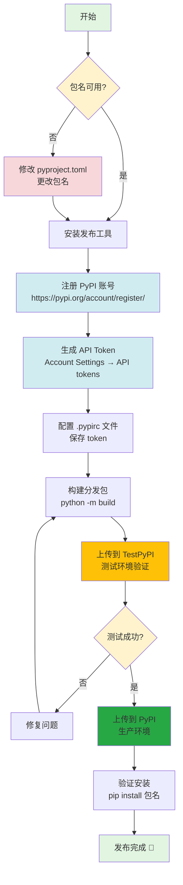

# 🚀 ConfigCrypt PyPI 发布完整指南

## ✅ 包名确认

**包名**: `configcrypt`

**状态**: ✅ 已成功上传到 PyPI

**项目地址**: https://pypi.org/project/configcrypt/

**安装命令**: `pip install configcrypt`

---

## 📋 发布流程图



---

## 📝 详细操作步骤

### Step 1: 确认包名

**当前包名**: `configcrypt`（已验证可用）

**无需修改** `pyproject.toml`，当前配置正确。

---

### Step 2: 构建分发包（如果还没构建）

```bash
# 如果已经构建过，跳过这一步
python -m build
```

**预期输出**:
```
dist/
├── configcrypt-1.0.0-py3-none-any.whl
└── configcrypt-1.0.0.tar.gz
```

**注意**: 如果您之前构建过 .exe 文件，dist 目录可能还有 `ConfigCrypt.exe`。这没关系，上传时我们只上传 .whl 和 .tar.gz 文件。

---

### Step 3: 安装发布工具

```bash
pip install --upgrade twine
```

**twine** 是官方推荐的 PyPI 上传工具。

---

### Step 4: 注册 PyPI 账号

#### 4.1 注册生产环境账号

访问: https://pypi.org/account/register/

填写信息:
- Username: _______
- Email: _______
- Password: _______（强密码，建议使用密码管理器）

**验证邮箱**: 收到验证邮件后点击链接激活账号

#### 4.2 注册测试环境账号（可选但推荐）

访问: https://test.pypi.org/account/register/

使用相同信息注册（测试环境和生产环境账号独立）

---

### Step 5: 生成 API Token

#### 5.1 生产环境 Token

1. 登录 https://pypi.org
2. 进入 **Account settings**
3. 滚动到 **API tokens** 部分
4. 点击 **Add API token**
5. 填写:
   - Token name: `configcrypt-cli-upload`（或任意名称）
   - Scope: **Entire account** （首次发布必须选这个）
6. 点击 **Create token**
7. **立即复制 token！** （只显示一次，格式：`pypi-...`）

#### 5.2 测试环境 Token（可选）

1. 登录 https://test.pypi.org
2. 重复上述步骤
3. 生成测试环境 token

---

### Step 6: 配置 `.pypirc` 文件

**位置**: `C:\Users\您的用户名\.pypirc` （Windows）

**内容**:
```ini
[distutils]
index-servers =
    pypi
    testpypi

[pypi]
username = __token__
password = pypi-YOUR_PRODUCTION_TOKEN_HERE

[testpypi]
repository = https://test.pypi.org/legacy/
username = __token__
password = pypi-YOUR_TEST_TOKEN_HERE
```

**替换**:
- `pypi-YOUR_PRODUCTION_TOKEN_HERE` → 您的生产环境 token
- `pypi-YOUR_TEST_TOKEN_HERE` → 您的测试环境 token（如果有）

**安全提示**: 
- 该文件包含敏感信息，不要提交到 Git
- 确保文件权限仅限当前用户读取

---

### Step 7: 上传到 TestPyPI（测试）

```bash
# ✅ 正确：只上传 Python 包
twine upload --repository testpypi dist/*.whl dist/*.tar.gz
```

**预期输出**:
```
Uploading distributions to https://test.pypi.org/legacy/
Uploading configcrypt-1.0.0-py3-none-any.whl
100% ━━━━━━━━━━━━━━━━━━━━━━━━━━━━━━━━━━━━━━━━ 69.4/69.4 kB • 00:02 • ?
Uploading configcrypt-1.0.0.tar.gz
100% ━━━━━━━━━━━━━━━━━━━━━━━━━━━━━━━━━━━━━━━━ 69.5/69.5 kB • 00:01 • ?

View at:
https://test.pypi.org/project/configcrypt/1.0.0/
```

**验证测试环境安装**:
```bash
# 创建新的虚拟环境测试
python -m venv test_env
test_env\Scripts\activate

# 从 TestPyPI 安装（需要指定依赖来源）
pip install --index-url https://test.pypi.org/simple/ --extra-index-url https://pypi.org/simple configcrypt

# 测试命令
cc --version

# 测试完成后退出
deactivate
rmdir /s /q test_env
```

---

### Step 8: 上传到 PyPI（生产环境）

**⚠️ 警告**: 
- 一旦上传到 PyPI，**无法删除**（只能标记为 yanked）
- 相同版本号无法重复上传
- 请确保代码已充分测试

**⚠️ 重要**: 只上传 Python 包文件，不要上传 .exe 文件！

```bash
# ✅ 正确：只上传 .whl 和 .tar.gz
twine upload dist/*.whl dist/*.tar.gz

# ❌ 错误：不要使用 dist/*（会尝试上传 .exe）
# twine upload dist/*
```

**预期输出**:
```
Uploading distributions to https://upload.pypi.org/legacy/
Uploading configcrypt-1.0.0-py3-none-any.whl
100% ━━━━━━━━━━━━━━━━━━━━━━━━━━━━━━━━━━━━━━━━ 69.4/69.4 kB • 00:02 • ?
Uploading configcrypt-1.0.0.tar.gz
100% ━━━━━━━━━━━━━━━━━━━━━━━━━━━━━━━━━━━━━━━━ 69.5/69.5 kB • 00:02 • ?

View at:
https://pypi.org/project/configcrypt/1.0.0/
```

---

### Step 9: 验证生产环境安装

```bash
# 创建新的虚拟环境
python -m venv verify_env
verify_env\Scripts\activate

# 从 PyPI 安装
pip install configcrypt

# 验证 CLI 命令
cc --version
cc status

# 验证 Library API
python -c "from configcrypt import VaultAPI; print('Import successful!')"

# 验证 GUI 启动（如果有图形界面）
# configcrypt-gui

# 清理
deactivate
rmdir /s /q verify_env
```

---

### Step 10: 更新 README.md 安装说明（如果需要）

安装说明已经正确：

```bash
pip install configcrypt
```

无需修改。

---

## 🔧 常见问题排查

### Q1: 上传失败 "403 Forbidden"

**原因**: API token 无效或权限不足

**解决**:
1. 检查 `.pypirc` 中的 token 是否正确
2. 确保 token scope 是 "Entire account"（首次发布必需）
3. 重新生成 token

### Q2: 上传失败 "400 Bad Request: File already exists"

**原因**: 该版本已上传

**解决**:
1. 如果是测试环境，删除 TestPyPI 项目后重试
2. 如果是生产环境，增加版本号（如 1.0.1）后重新构建上传

### Q3: 包名已存在

**原因**: 其他人已使用该包名

**解决**:
1. 更改 `pyproject.toml` 中的包名
2. 重新构建和上传

### Q4: 依赖安装失败

**原因**: TestPyPI 不包含完整依赖包

**解决**:
```bash
# 使用混合源安装
pip install --index-url https://test.pypi.org/simple/ \
            --extra-index-url https://pypi.org/simple \
            configcrypt-cli
```

### Q5: 忘记 API Token

**原因**: Token 只显示一次

**解决**:
1. 删除旧 token
2. 生成新 token
3. 更新 `.pypirc` 文件

---

## 📊 发布后监控

### 查看项目统计

- 访问: https://pypi.org/project/configcrypt-cli/
- 查看下载量: https://pepy.tech/project/configcrypt-cli

### 设置 PyPI Badge

在 README.md 中添加:
```markdown
[](https://badge.fury.io/py/configcrypt-cli)
[](https://pepy.tech/project/configcrypt-cli)
```

---

## 🔐 安全最佳实践

1. ✅ **使用 API Token**，不使用密码
2. ✅ **限制 Token Scope**（首次上传后，创建项目专用 token）
3. ✅ **保护 `.pypirc` 文件**，添加到 `.gitignore`
4. ✅ **启用 2FA**（PyPI 账号设置）
5. ✅ **定期轮换 Token**（建议每 6 个月）

---

## 🎉 发布成功检查清单

- [ ] 包名可用性检查
- [ ] 修改 `pyproject.toml` 包名
- [ ] 安装 `twine`
- [ ] 注册 PyPI 账号
- [ ] 生成 API Token
- [ ] 配置 `.pypirc` 文件
- [ ] 重新构建分发包
- [ ] 上传到 TestPyPI
- [ ] 在测试环境验证安装
- [ ] 上传到 PyPI 生产环境
- [ ] 在新环境验证安装
- [ ] 更新 README.md 安装说明
- [ ] 添加 PyPI Badge（可选）
- [ ] 宣传发布（可选）

---

## 📞 需要帮助？

- PyPI 官方文档: https://packaging.python.org/
- Twine 文档: https://twine.readthedocs.io/
- PyPI 支持: https://pypi.org/help/

---

**文档生成时间**: 2025-06-08  
**适用版本**: ConfigCrypt v1.0.0
